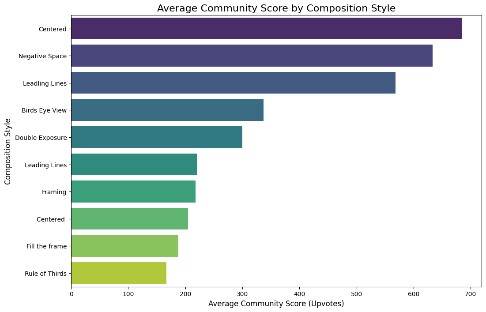
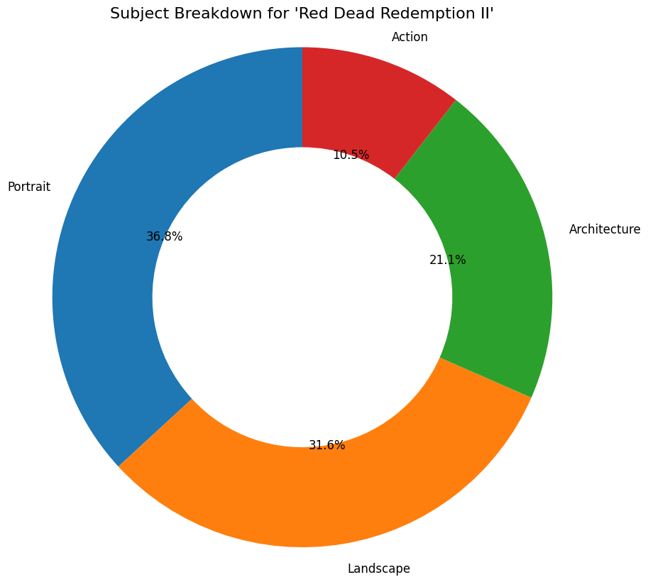

# Pixels & Perspectives: A Data-Driven Analysis of In-Game Photography

A data analysis project that explores a dataset of 150+ top-rated virtual photos to uncover the key characteristics of a successful image.

---

### ## 📌 Introduction

Virtual photography is a rapidly growing art form where players capture the beauty of digital worlds. This project sought to answer the question: **What makes an in-game photograph successful?** I collected data from online communities and used Python and SQL to find data-driven insights into the subjects, compositions, and games that resonate most with audiences.

---

### ## 🚀 Key Findings

My analysis uncovered several key trends:

1.  **A Tale of Two Eras:** The most popular games are _Red Dead Redemption II_ and _Cyberpunk 2077_, highlighting a community fascination with both the romanticized **past** and the speculative **future**.

2.  **Timeless Artistry:** The continued dominance of _RDR2_ (a 2018 game) in photos from the past year points to its timeless graphics and unique aesthetics.

3.  **Bold Compositions Win:** The most crucial finding is that what is common is not what is most successful. The highest-rated photos utilized **'Centered'** and **'Negative Space'** compositions, challenging the conventional wisdom of the 'Rule of Thirds'.

---

### ## 📊 Key Visualizations

#### The highest-rated compositions are not the most common:

#### Case Study: _Red Dead Redemption II_ is used more for portraits and landscapes than action.

---

### ## 🛠️ Methodology

1.  **Data Collection:** Scraped over 99 top-rated images from the past year from Reddit communities like r/virtualphotographers and r/divinegamingphotos.
2.  **Data Classification:** Manually categorized each image by `game_name`, `subject_type`, `composition_style`, and `dominant_color`.
3.  **Database:** Loaded the dataset into an SQLite database for querying.
4.  **Analysis & Visualization:** Used Python with Pandas to query the database and Matplotlib/Seaborn to generate visualizations in a Jupyter Notebook.

---

### ## 📂 Files in this Repository

- `analysis.ipynb`: The complete Jupyter Notebook with all code, analysis, and findings.
- `photos.csv`: The raw dataset used for the analysis.
- `portfolio_summary.pdf`: A one-page summary of the project.
